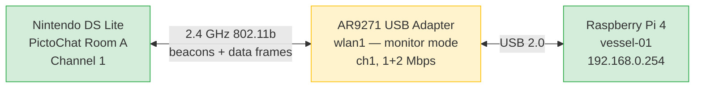
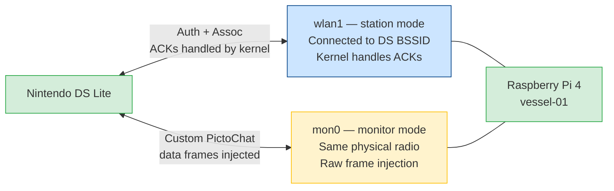
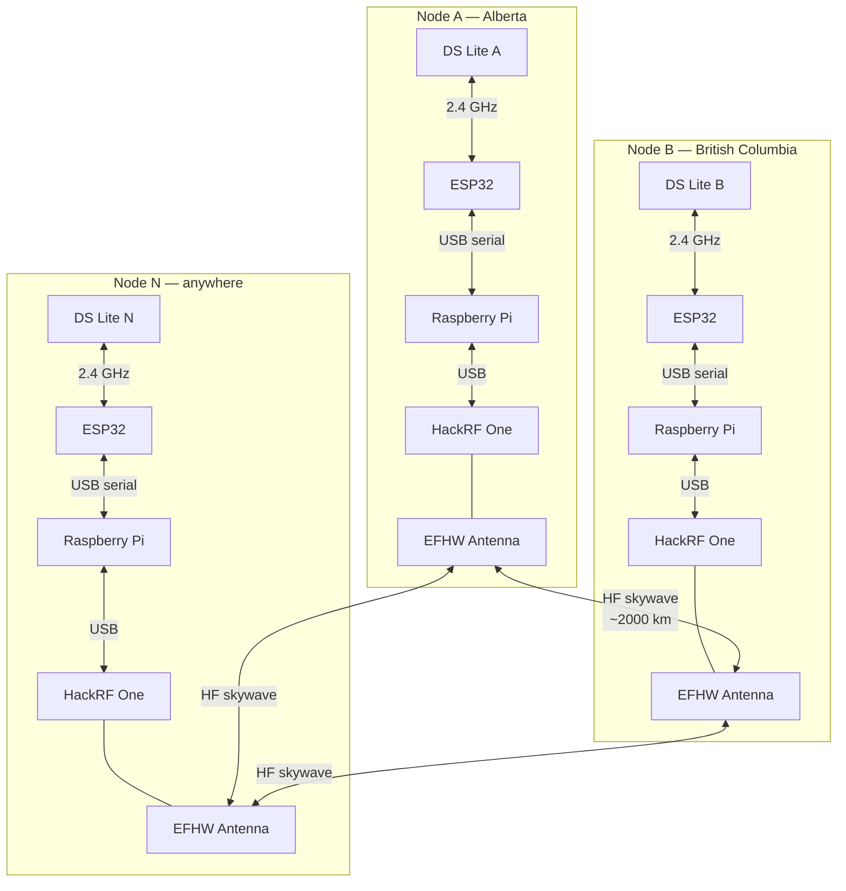
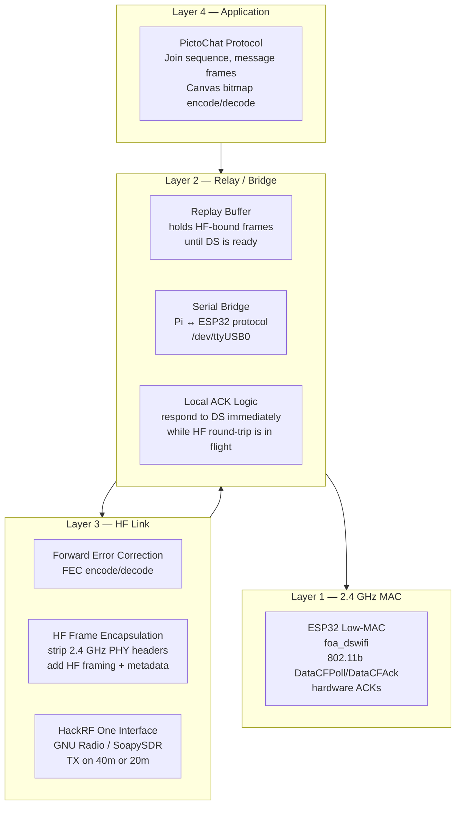
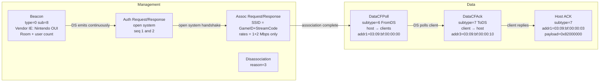
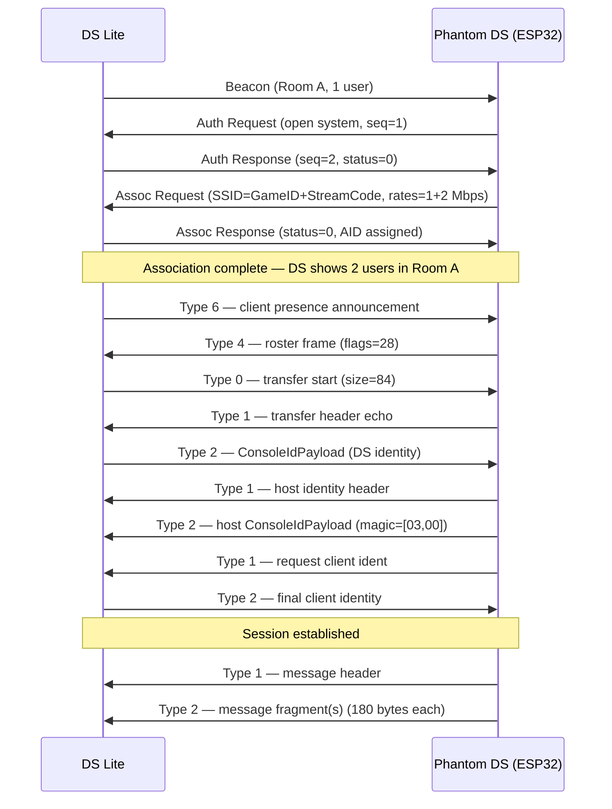
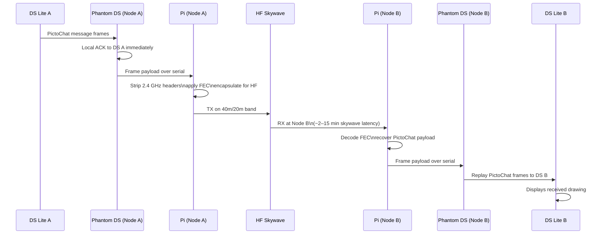

# PictoChat-HF Architecture

Full hardware and software architecture for the PictoChat-HF relay system. Covers current state, target single-node state, and multi-node mesh.

---

## Hardware Architecture

### Current State (Phase 2b complete — ESP32 hosting DS, bidirectional echo verified)



**Limitation:** AR9271 in monitor mode does not generate 802.11 ACKs — the DS cannot complete association, so injected frames are dropped.

---

### Phase 2a — Dual-Interface Experiment (AR9271, experimental)



---

### Phase 2b — Target Single-Node State (ESP32 primary path)

```mermaid
graph LR
    DS[Nintendo DS Lite\nPictoChat Room A]
    ESP[ESP32-WROOM-32\nfoa_dswifi firmware\nLow-MAC 802.11b\nHardware ACKs]
    PI[Raspberry Pi 4\nvessel-01]
    HRF[HackRF One\nSDR TX/RX]
    ANT[EFHW Antenna\n40m or 20m band]
    ION[Ionosphere\nSkywave bounce]

    DS <-->|2.4 GHz 802.11b\nDataCFPoll / DataCFAck\nFull association| ESP
    ESP <-->|USB serial\n/dev/ttyUSB0\nCP2102| PI
    PI <-->|USB| HRF
    HRF <-->|RF coax| ANT
    ANT <-->|HF skywave\n~7 MHz or 14 MHz| ION

    style DS fill:#d4edda,stroke:#28a745
    style ESP fill:#cce5ff,stroke:#004085
    style PI fill:#d4edda,stroke:#28a745
    style HRF fill:#f8d7da,stroke:#721c24
    style ANT fill:#e2e3e5,stroke:#383d41
    style ION fill:#fefefe,stroke:#adb5bd,stroke-dasharray:5 5
```



---

### Multi-Node Architecture (Phase 4 target)



Each node is identical hardware. Any node relays to any other node. The HF mesh is the only long-haul link.

---

## Software Architecture

### Layer Stack



---

### PictoChat 802.11 Frame Types



---

### PictoChat Application Join Sequence



---

### HF Relay Flow (Single Message, One Direction)



---

## Component Inventory

| Component | Node | Connection | Status |
| :--- | :--- | :--- | :--- |
| Raspberry Pi 4 | A | — | Deployed (vessel-01) |
| AR9271 USB WiFi | A | USB → wlan1 | Present |
| ESP32-WROOM-32 | A | USB → /dev/ttyUSB0 | Deployed (vessel-01) |
| HackRF One | A | USB | Not acquired |
| EFHW antenna | A | RF coax | Not acquired |
| DS Lite | A | 2.4 GHz to ESP32 | Present |
| All Node B hardware | B | — | Not acquired |

---

## Key Protocol Constants

| Constant | Value |
| :--- | :--- |
| DS Lite BSSID | `00:23:cc:f8:9e:3e` (captured — may change if DS reboots) |
| Nintendo vendor IE OUI | `00:09:BF` |
| Stream code (last capture) | `0xAB38` — **read from beacon at runtime** |
| Room A channel | 1 (2412 MHz) |
| Supported rates | 1 Mbps (0x82) + 2 Mbps (0x84) only |
| Beacon interval | 105 TU (~107 ms) |
| Max fragment size (DS Lite) | 180 bytes per type 2 message fragment |
| Nintendo multicast host→client | `03:09:bf:00:00:00` |
| Nintendo multicast client→host | `03:09:bf:00:00:10` |
| Nintendo multicast host ACK | `03:09:bf:00:00:03` |
| ESP32 host MAC (Node A) | `a4:f0:0f:61:9f:b0` |
| Text message canvas size | 2048 bytes (assembled from 13×172 + 1×16 byte type-2 fragments) |
| Drawing canvas size | 10240 bytes (5 pages × 2048) |
| Last fragment marker | `transfer_flags == 1` (byte 7 in raw type-2 frame) |
| End-of-burst flag | `HostToClientFlags` bit 7 (0x80) — must be set on last echoed/sent fragment |

---

## Message Relay Protocol

### Relay unit: `MessagePayload`

The assembled `MessagePayload` from `pictochat_application.rs` is the relay unit passed
between nodes. It is DS-agnostic — any DS that joins and sends a message produces the same
format:

| Field | Size | Notes |
| :--- | :--- | :--- |
| magic | 1 byte | fixed |
| subtype | 1 byte | 0 = text+drawing, 1 = identity |
| from | 6 bytes | set to **destination node's host MAC** before sending to DS |
| magic_1 | 14 bytes | fixed |
| safezone | 14 bytes | fixed |
| message | 2048 or 10240 bytes | PictoChat canvas bitmap |

The `from` field is overwritten with the local host MAC at each relay hop so the receiving
DS accepts the message as originating from its room host.

### Inter-node TCP framing (implemented in `server_connection_task`, `main.rs`)

```
┌──────────┬──────────────┬──────────────────────────┐
│ type (1B)│ length (2B BE)│ payload (length bytes)   │
└──────────┴──────────────┴──────────────────────────┘

type 0x00 = handshake (no payload)
type 0xFD = data (payload = serialized MessagePayload)
type 0xAD = error
```

### Phase 3 relay path

```
Node A DS → ESP32 inbound_queue → serialize → TCP 0xFD frame → relay server / HF bridge
                                                                        ↓
Node B DS ← ESP32 outbound_queue ← set from=hostMAC ← deserialize ← TCP 0xFD frame
```

For pre-HF testing: relay server is a simple TCP forwarding process on the internet.
For HF: Pi replaces TCP relay — reads serial from ESP32, encapsulates for HackRF TX.

### Main loop changes required (Phase 3)

1. Spawn `server_connection_task` in `main()`
2. Route `inbound_queue` messages to the TCP send channel instead of `outbound_queue`
3. Add a third `select` arm receiving from the TCP receive channel → `outbound_queue`
